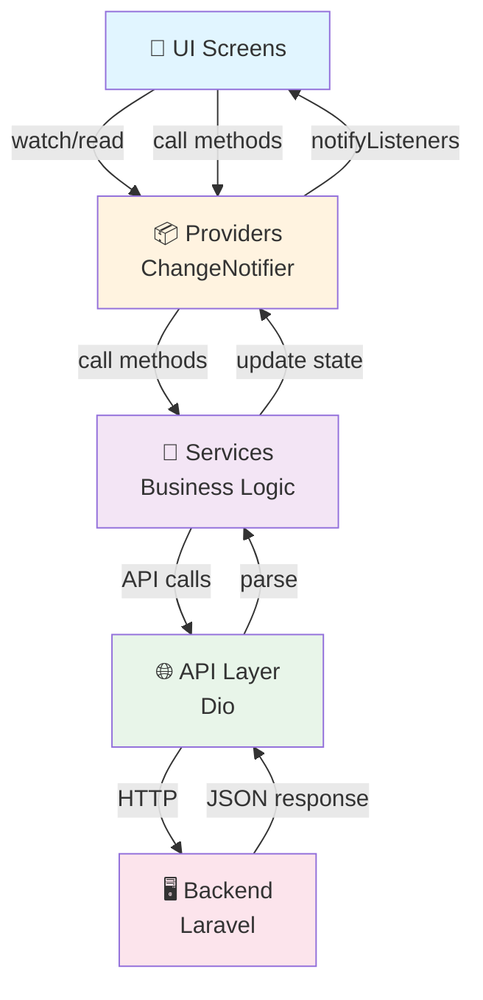
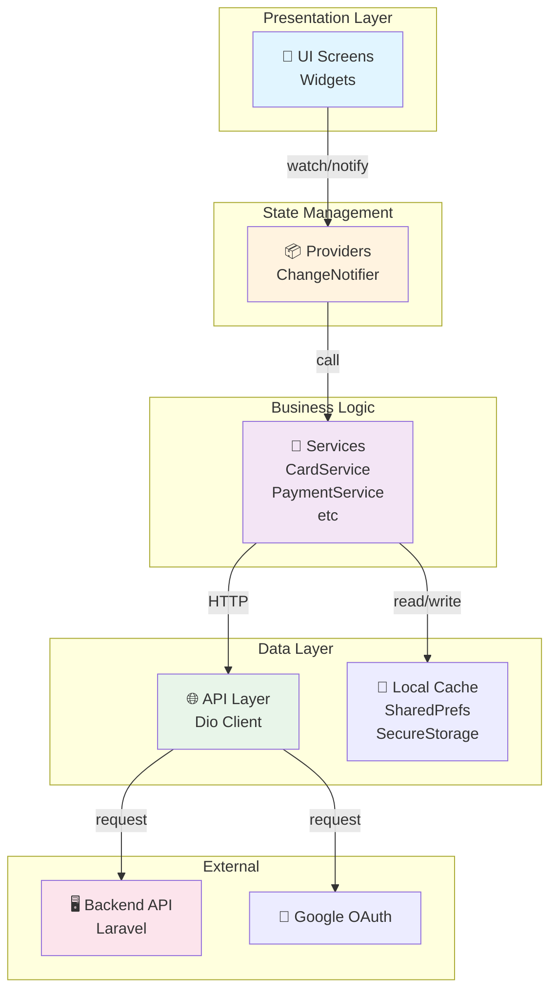

# 🏗️ Architecture Flutter KART

**Date** : 18 Mai 2026  
**Version** : 1.0  
**Auteur** : Architecture Team

---

## 📐 Patterns architecturaux

### Pattern principal : Feature-based Architecture

KART utilise une **architecture modulaire basée sur les features**. Chaque feature est indépendante et contient tous ses composants (UI, logic, data).

```
lib/
├── core/              # Éléments partagés globalement
├── features/          # Modules métier indépendants
├── shared/            # Widgets et services réutilisables
└── main.dart          # Point d'entrée
```

### Avantages de ce pattern

✅ **Scalabilité** : Ajouter une feature = ajouter un dossier  
✅ **Maintenabilité** : Chaque feature est isolée  
✅ **Réutilisabilité** : Code partagé dans `shared/`  
✅ **Team collaboration** : Chaque dev sur sa feature  
✅ **Testing** : Tests localisés par feature  

---

## 🗂️ Structure complète des dossiers

### 1. `lib/core/` - Infrastructure globale

```
core/
├── network/
│   ├── api_client.dart          # Dio configuration + JWT management
│   ├── api_endpoints.dart       # Toutes les URLs d'API
│   └── interceptors.dart        # Gestion erreurs, retry logic
├── theme/
│   ├── app_theme.dart           # ThemeData light/dark
│   └── theme_provider.dart      # ChangeNotifier pour thème
└── constants/
    └── app_constants.dart       # Valeurs constantes
```

#### `api_client.dart` - Architecture HTTP

```dart
class ApiClient {
  static final Dio dio = Dio(BaseOptions(...));
  
  // Token management avec fallback
  - flutter_secure_storage (principal)
  - shared_preferences (fallback)
  
  Methods:
  - setToken()   : Sauvegarde JWT sécurisé
  - getToken()   : Récupère JWT depuis stockage
  - clearToken() : Logout - supprime JWT
}
```

**Flow d'authentification HTTP** :

```
Request → Header Authorization: Bearer <JWT>
  ↓
Response 401 → Token expiré
  ↓
Refresh token automatiquement
  ↓
Retry la requête
```

### 2. `lib/features/` - Modules métier

Chaque feature suit la structure :

```
feature_name/
├── ui/                    # Toutes les screens et widgets
│   ├── feature_screen.dart
│   ├── widgets/
│   └── dialogs/
├── providers/             # Providers (State Management)
│   └── feature_provider.dart
├── services/              # Business logic, API calls
│   └── feature_service.dart
├── models/                # Data models
│   └── feature_model.dart
├── data/                  # API layer (optionnel)
│   └── feature_api.dart
└── exceptions/            # Exceptions métier
    └── custom_exception.dart
```

#### Features implémentées

| Feature | Responsabilité | État |
|---------|-----------------|------|
| **auth** | Login, Register, JWT, Google OAuth | ✅ Complet |
| **digital_card** | Création/édition carte, QR code, themes | ✅ Complet |
| **card_scanner** | Scan camera, OCR, preview | ✅ Complet |
| **contacts** | Liste contacts, recherche, groupement | ✅ Complet |
| **leads** | Tracking shares, analytics | ✅ Complet |
| **onboarding** | Créer/rejoindre company | ✅ Complet |
| **payment** | Plans, payment methods, webview | ✅ Complet |
| **plans** | Sélection plans, affichage détails | ✅ Complet |
| **profile_completion** | Expériences, formations, réseaux | ✅ Complet |
| **navigation** | Bottom nav, routing | ✅ Complet |
| **scan** | Switcher QR/Card scan | ✅ Complet |
| **profile** | Profil utilisateur, settings | ✅ Complet |
| **public_card** | Affichage public de carte | ✅ Complet |

### 3. `lib/shared/` - Code réutilisable

```
shared/
├── widgets/                 # Composants réutilisables
│   ├── auth_text_field.dart
│   ├── auth_primary_button.dart
│   ├── custom_card.dart
│   └── loading_shimmer.dart
├── services/                # Services globaux
│   ├── user_service.dart
│   ├── card_service.dart
│   └── analytics_service.dart
└── utils/                   # Utilitaires
    ├── formatters.dart
    ├── validators.dart
    └── extensions.dart
```

---

## 🔄 State Management - Provider Pattern

### Architecture du flux d'état

```
UI Layer (Widgets)
    ↓
Provider (ChangeNotifier) - Gère l'état
    ↓
Services - Logique métier
    ↓
API Client - Appels backend
    ↓
Backend
```

### Providers principaux

```dart
class AuthProvider extends ChangeNotifier {
  User? user;
  bool isAuthenticated;
  
  Methods:
  - login()        : Authentification email/password
  - register()     : Création compte
  - googleLogin()  : OAuth Google
  - logout()       : Déconnexion
  - loadMe()       : Charger utilisateur courant
  - updateProfile(): Mise à jour profil
}

class CardProvider extends ChangeNotifier {
  String? qrSvg;       // QR code SVG
  String? theme;       // Thème sélectionné
  CardStatus status;   // idle/loading/hasCard/error
  
  Methods:
  - loadCardSummary()  : Charger la carte
  - updateCard()       : Mise à jour données
  - changeTheme()      : Changer design
  - generateQR()       : Générer QR code
}

class ContactsProvider extends ChangeNotifier {
  List<ContactModel> contacts;
  
  Methods:
  - fetchGroupedContacts()  : Charger contacts groupés
  - searchContacts()        : Recherche
  - deleteContact()         : Supprimer
  - exportCsv()             : Export
}

class PaymentProvider extends ChangeNotifier {
  List<Payment> payments;      // Historique paiements
  Payment? currentPayment;     // Paiement en cours
  PaymentStatus status;
  
  Methods:
  - initializePayment()  : Initialiser un paiement
  - checkStatus()        : Vérifier statut
  - fetchHistory()       : Historique
}

class LeadsProvider extends ChangeNotifier {
  List<Lead> leads;           // Contacts générés
  Map<String, int> stats;     // Statistiques
  
  Methods:
  - fetchLeads()         : Charger leads
  - trackShare()         : Enregistrer partage
  - getAnalytics()       : Statistiques d'engagement
}

class ProfileCompletionProvider extends ChangeNotifier {
  ProfileCompletionModel profile;  // Données du profil
  
  Methods:
  - load()               : Charger profil
  - addExperience()      : Ajouter expérience
  - addEducation()       : Ajouter formation
  - updateSocials()      : Mise à jour réseaux
}
```

### Pattern d'utilisation des Providers

#### Initialisation (main.dart)

```dart
MultiProvider(
  providers: [
    ChangeNotifierProvider(create: (_) => ThemeProvider()),
    ChangeNotifierProvider(create: (_) => AuthProvider()),
    ChangeNotifierProvider(create: (_) => CardProvider()),
    // ... autres providers
  ],
  child: MyApp(),
)
```

#### Dans les widgets

```dart
// Lecture seule (Consumer/watch)
Widget build(BuildContext context) {
  final card = context.watch<CardProvider>();
  return Text(card.qrSvg ?? 'Loading');
}

// Appel de méthodes (Provider.of<T>().method())
void _saveCard() {
  final provider = context.read<CardProvider>();
  provider.updateCard(...);
}

// Avec Consumer pour rebuild limité
Consumer<CardProvider>(
  builder: (context, cardProvider, child) {
    return Text(cardProvider.theme ?? 'default');
  },
)
```

---

## 🛣️ Navigation & Routing

### Route Architecture

```
splash: '/'
   ↓
Login/Register: '/login', '/register'
   ↓
Onboarding: '/plans', '/onboarding'
   ↓
HomeShell: '/home' (4 tabs)
   ├── DigitalCard: '/digital-card'
   ├── Scan: '/scan'
   ├── Contacts: '/contacts'
   └── Profile: '/profile'
```

### Hiérarchie de navigation

```dart
MaterialApp(
  routes: {
    '/': (_) => SplashScreen(),
    '/login': (_) => LoginPage(),
    '/register': (_) => RegisterPage(),
    '/complete-profile': (_) => CompleteProfilePage(),
    '/plans': (_) => PlanSelectionPage(),
    '/payment/methods': (_) => PaymentMethodScreen(),
    '/home': (_) => HomeShell(),
    '/digital-card': (_) => MyDigitalCardPage(),
    '/scan': (_) => ScanPage(),
    '/contacts': (_) => ContactsPage(),
    '/profile': (_) => ProfilePage(),
  },
)
```

### Flow d'authentification

```
SplashScreen (vérifier JWT)
    ↓
├─→ JWT valide      → HomeShell (main app)
├─→ JWT invalide    → LoginPage
└─→ Nouveau user    → PlanSelectionPage
```

---

## 📊 Diagramme flux de données complet



---

## 🔐 Sécurité des données

### Flux d'authentification JWT

```
Login (email/password)
    ↓
Backend retourne: access_token
    ↓
Sauvegarder dans SecureStorage
    ↓
Ajouter header: Authorization: Bearer {token}
    ↓
Toutes les requêtes incluent le token
    ↓
Si 401 → Token expiré
    ↓
Refresh token automatique
    ↓
Retry requête
    ↓
Si refresh échoue → Logout
```

### Stockage sécurisé

```dart
// Token JWT
SecureStorage: 'auth_token' → Keychain (iOS) / Keystore (Android)
Fallback: SharedPreferences

// Préférences utilisateur
SharedPreferences: Pas sensible (non-crypto)

// Images/Fichiers
Application Documents Directory: Fichiers app
Cache Directory: Cache temporaire
```

---

## 🎯 Decision patterns

### 1. Quand utiliser Provider vs Service ?

| Cas | Utiliser |
|-----|----------|
| Gestion d'état persistant UI | **Provider** |
| Appel API isolé | **Service** |
| Données partagées app-wide | **Provider** |
| Logique métier réutilisable | **Service** |
| Track des mutations | **Provider** |

### 2. Quand créer une nouvelle Feature ?

✅ Créer feature si :
- Distinct domaine métier
- UI indépendante
- Peut être développée parallèlement
- Réutilisable par d'autres features

❌ Ne pas créer feature si :
- Juste un widget/écran
- Très dépendant d'autre feature
- Code < 200 lignes

### 3. Erreur handling

```dart
// Service layer
Future<void> loadCard() async {
  try {
    final response = await _api.getCard();
    _status = CardStatus.hasCard;
  } on DioException catch (e) {
    _error = _mapDioException(e);  // Convert to user-friendly message
    _status = CardStatus.error;
  }
  notifyListeners();
}

// Widget layer
if (card.hasError) {
  showErrorDialog(context, card.error);
}
```

---

## 🚀 Performance optimizations

### 1. Widget rebuild optimization

```dart
// ❌ Mauvais : Rebuild tout le widget
Consumer<CardProvider>(
  builder: (context, card, _) {
    return Column(
      children: [
        Text(card.name),
        Text(card.qrSvg),      // Rebuild même si QR change pas
        ExpensiveWidget(),      // Rebuild inutilement
      ],
    );
  },
)

// ✅ Bon : Consumer spécifique
Column(
  children: [
    Text(card.name),
    Consumer<CardProvider>(
      builder: (_, card, __) => Text(card.qrSvg),
    ),
    ExpensiveWidget(),  // Pas de rebuild
  ],
)
```

### 2. Lazy loading images

```dart
CachedNetworkImage(
  imageUrl: url,
  placeholder: (context, url) => ShimmerLoading(),
  errorWidget: (context, url, error) => ErrorWidget(),
)
```

### 3. List performance

```dart
ListView.builder(
  itemCount: items.length,
  itemBuilder: (context, index) {
    return ListTile(title: Text(items[index].name));
  },
)
```

---

## 🧩 Dépendances et relationships

### Dependency Graph

```
main.dart
├─ ThemeProvider
├─ AuthProvider
│  └─ ApiClient
│     └─ api_endpoints
├─ CardProvider
│  └─ CardService
│     └─ ApiClient
├─ ContactsProvider
│  └─ ApiClient
├─ PaymentProvider
│  └─ PaymentService
├─ LeadsProvider
└─ ProfileCompletionProvider
   └─ ProfileCompletionService
```

### Cicles de dépendances : ✅ AUCUN

Le projet évite les cicles directs de dépendances.

---

## 📈 Scalabilité future

### Pour ajouter une nouvelle feature :

1. Créer dossier `lib/features/my_feature/`
2. Suivre la structure standard
3. Créer le Provider
4. Créer les UI screens
5. Ajouter le Provider à `main.dart`
6. Ajouter les routes

### Pour ajouter un nouveau Provider :

```dart
// 1. Créer provider
class MyFeatureProvider extends ChangeNotifier {
  // State
  // Methods
  // Getters
}

// 2. Ajouter à main.dart
MultiProvider(
  providers: [
    ChangeNotifierProvider(create: (_) => MyFeatureProvider()),
  ],
)

// 3. Utiliser dans UI
final myFeature = context.watch<MyFeatureProvider>();
```

---

## 🔍 Code quality patterns

### Naming conventions

```dart
// Variables
bool isLoading;
String? errorMessage;
List<Contact> contacts;

// Methods
void loadContacts()
Future<void> updateProfile()
bool isValidEmail()

// Classes
class CardProvider extends ChangeNotifier {}
class LoginPage extends StatelessWidget {}
class MyCustomButton extends StatefulWidget {}

// Constants
const int maxContactsPerPage = 20;
const String defaultTheme = 'default';
```

### Error handling

```dart
// ❌ Mauvais
catch (e) {
  print(e);  // Perte d'info
}

// ✅ Bon
catch (e, st) {
  debugPrint('Error: $e\nStack: $st');
  _error = 'Unable to load data';  // Message utilisateur
}
```

---

## 📊 Architecture Diagram (Mermaid)



---

## ✅ Bonnes pratiques appliquées

- ✅ Feature-based architecture
- ✅ Separation of concerns (UI/Logic/Data)
- ✅ DRY principle (Don't Repeat Yourself)
- ✅ SOLID principles partiellement
- ✅ Consistent naming conventions
- ✅ Error handling at each layer
- ✅ No circular dependencies
- ✅ Immutable models (partial)
- ✅ Provider pattern for state
- ✅ Constants centralized

---

## 🎓 Ressources d'apprentissage

- [Flutter Architecture Patterns](https://flutter.dev/docs/development/data-and-backend)
- [Provider Documentation](https://pub.dev/packages/provider)
- [Effective Dart](https://dart.dev/guides/language/effective-dart)
- [SOLID Principles](https://en.wikipedia.org/wiki/SOLID)

---

**Dernière mise à jour** : 18 Mai 2026  
**Responsable** : Architecture Team  
**Status** : ✅ Validé
