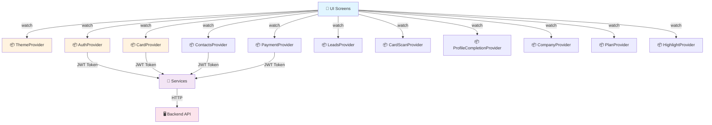

# 📦 State Management - KART

**Pattern** : Provider (ChangeNotifier)  
**Version** : 6.1.2  
**Date** : 18 Mai 2026

---

## 🎯 Why Provider?

KART uses **Provider** for state management because:

✅ **Simple** - Easy to learn and implement  
✅ **Efficient** - Rebuilds only affected widgets  
✅ **Scalable** - Works well with feature-based architecture  
✅ **Type-safe** - Full Dart type checking  
✅ **Testable** - Easy to mock and test  
✅ **Community** - Well-maintained by Remi Boulanger  

---

## 🏗️ Complete Providers Map

### Initialization (main.dart)

```dart
void main() {
  runApp(const KartApp());
}

class KartApp extends StatelessWidget {
  @override
  Widget build(BuildContext context) {
    return MultiProvider(
      providers: [
        // Theme
        ChangeNotifierProvider(create: (_) => ThemeProvider()),
        
        // Authentication
        ChangeNotifierProvider(create: (_) => AuthProvider()),
        
        // Digital Card
        ChangeNotifierProvider(create: (_) => CardProvider()),
        
        // Contacts
        ChangeNotifierProvider(create: (_) => HighlightProvider()),
        ChangeNotifierProvider(
          create: (_) => ContactsProvider()..fetchGroupedContacts(),
        ),
        
        // Onboarding
        ChangeNotifierProvider(create: (_) => CompanyProvider()),
        
        // Plans
        ChangeNotifierProvider(
          create: (_) => PlanProvider(service: PlanService()),
        ),
        
        // Payments
        ChangeNotifierProvider(create: (_) => PaymentProvider()),
        
        // Card Scanner
        ChangeNotifierProvider(create: (_) => CardScanProvider()),
        
        // Leads
        ChangeNotifierProvider(create: (_) => LeadsProvider()),
        
        // Profile Completion
        ChangeNotifierProvider(
          create: (_) => ProfileCompletionProvider(
            ProfileCompletionService(),
          )..load(),
        ),
      ],
      child: Consumer<ThemeProvider>(
        builder: (context, themeProvider, _) {
          return MaterialApp(
            theme: AppTheme.light(),
            darkTheme: AppTheme.dark(),
            themeMode: themeProvider.themeMode,
            home: const SplashScreen(),
          );
        },
      ),
    );
  }
}
```

---

## 📋 Provider Details

### 1. ThemeProvider

**Responsability** : App theme management (light/dark)

```dart
class ThemeProvider extends ChangeNotifier {
  ThemeMode _themeMode = ThemeMode.system;
  
  ThemeMode get themeMode => _themeMode;
  
  void toggleTheme() {
    _themeMode = _themeMode == ThemeMode.light
        ? ThemeMode.dark
        : ThemeMode.light;
    notifyListeners();
  }
  
  void setThemeMode(ThemeMode mode) {
    _themeMode = mode;
    notifyListeners();
  }
}
```

**Usage** :
```dart
// In widget
Consumer<ThemeProvider>(
  builder: (context, themeProvider, child) {
    return MaterialApp(
      theme: AppTheme.light(),
      darkTheme: AppTheme.dark(),
      themeMode: themeProvider.themeMode,
    );
  },
)

// Toggle theme
context.read<ThemeProvider>().toggleTheme();
```

---

### 2. AuthProvider (★ Core)

**Responsability** : User authentication, login, logout, JWT management

```dart
class AuthProvider extends ChangeNotifier {
  // STATE
  bool isLoading = false;
  bool isGoogleLoading = false;
  bool isNewUser = false;
  User? user;
  String? error;
  String? errorDetails;
  bool _isInitialized = false;

  // GETTERS
  bool get isAuthenticated => user != null;
  bool get isPro => user?.isPro ?? false;
  bool get hasCompany => user?.hasCompany ?? false;
  bool get isInitialized => _isInitialized;

  // METHODS
  Future<void> login(String email, String password)
  Future<void> register({...})
  Future<void> loginWithGoogle()
  Future<void> logout()
  Future<void> loadMe()
  Future<bool> updateProfile({...})
}
```

**Data flow** :

```
Login UI → AuthProvider.login()
         ↓
    API call via AuthApi
         ↓
    Parse JWT token
         ↓
    Save to SecureStorage via ApiClient
         ↓
    Load user data via loadMe()
         ↓
    notifyListeners() → UI updates
         ↓
    If authenticated → Navigate to /home
```

**Usage** :
```dart
// Watch entire provider
final auth = context.watch<AuthProvider>();

// Check if authenticated
if (auth.isAuthenticated) {
  // Show home
}

// Show error
if (auth.error != null) {
  ErrorDialog(message: auth.error!);
}

// Call method
context.read<AuthProvider>().login('user@example.com', 'password');
```

---

### 3. CardProvider (★ Core business logic)

**Responsability** : User's digital card management

```dart
enum CardStatus {
  idle,
  loading,
  hasCard,
  noCard,
  error,
}

class CardProvider extends ChangeNotifier {
  // STATUS
  CardStatus _status = CardStatus.idle;
  
  // CARD DATA
  String? _qrSvg;              // QR code SVG
  String? _theme;              // Selected theme
  String? jobTitle;
  String? company;
  String? phone;
  String? email;
  String? linkedin;
  String? website;
  String? github;
  String? instagram;
  String? facebook;
  
  List<dynamic> experiences = [];
  List<dynamic> educations = [];
  
  // METRICS
  int? scanCount;
  int? shareCount;
  
  // SHARE
  String? _slug;
  String? _shareUrl;
  
  // COMPANY BRANDING
  String? _companyLogo;
  String? _companyPrimaryColor;
  
  // ERROR
  String? _error;
  
  // LOADING
  bool _isQrLoading = false;
  bool _isSummaryLoading = false;

  // GETTERS
  String? get qrSvg => _qrSvg;
  String? get theme => _theme;
  String? get error => _error;
  bool get isLoading => _isQrLoading || _isSummaryLoading;
  bool get hasError => _error != null;
  bool get hasQrCode => _qrSvg != null && _qrSvg!.isNotEmpty;
  bool get isReady => _status == CardStatus.hasCard && hasQrCode;
  CardStatus get status => _status;

  // METHODS
  Future<void> loadCardSummary()
  Future<void> updateCard({...})
  Future<void> changeTheme(String themeName)
  Future<void> generateQrCode()
  Future<void> shareCard()
}
```

**Lifecycle** :
```
1. Load: GET /me/card
2. Parse response into local state
3. Generate QR code (if needed)
4. Make available to UI

5. Update: PUT /me/card with new data
6. Reload to verify changes
7. Notify listeners

8. Error: Set status to error + display message
```

---

### 4. ContactsProvider

**Responsability** : Manage scanned contacts, search, export

```dart
class ContactsProvider extends ChangeNotifier {
  List<ContactModel> _contacts = [];
  Map<String, List<ContactModel>> _groupedContacts = {};
  bool _isLoading = false;
  String? _error;
  String _searchQuery = '';

  // GETTERS
  List<ContactModel> get contacts => _contacts;
  Map<String, List<ContactModel>> get groupedContacts => _groupedContacts;
  bool get isLoading => _isLoading;
  List<ContactModel> get filteredContacts =>
      _contacts.where((c) => c.fullname.toLowerCase().contains(_searchQuery.toLowerCase()))
          .toList();

  // METHODS
  Future<void> fetchGroupedContacts()
  Future<void> searchContacts(String query)
  Future<void> deleteContact(int id)
  Future<void> exportToCSV()
  void updateSearchQuery(String query)
}
```

---

### 5. PaymentProvider

**Responsability** : Payment processing, plan selection, history

```dart
class PaymentProvider extends ChangeNotifier {
  List<Payment> _payments = [];
  Payment? _currentPayment;
  PaymentStatus _status = PaymentStatus.pending;
  bool _isLoading = false;
  String? _error;

  // GETTERS
  List<Payment> get payments => _payments;
  Payment? get currentPayment => _currentPayment;
  bool get isLoading => _isLoading;

  // METHODS
  Future<void> initializePayment(int planId, String method)
  Future<void> checkPaymentStatus(String reference)
  Future<void> fetchPaymentHistory()
  Future<PaymentInitResult> getPaymentUrl(int planId)
}
```

**Payment flow** :
```
1. User selects plan
2. App calls initializePayment()
3. Backend creates payment + returns URL
4. App opens WebView with payment URL
5. User enters payment info on Stripe/PayPal
6. Backend processes payment
7. Backend redirects to app
8. App verifies payment status
9. Update user plan if successful
```

---

### 6. LeadsProvider

**Responsability** : Track contacts/leads generated from card sharing

```dart
class LeadsProvider extends ChangeNotifier {
  List<Lead> _leads = [];
  Map<String, int> _stats = {};
  bool _isLoading = false;

  // METHODS
  Future<void> fetchLeads()
  Future<void> trackShare(Contact contact)
  Future<void> getAnalytics()
}
```

---

### 7. CardScanProvider

**Responsability** : Business card scanning and OCR

```dart
class CardScanProvider extends ChangeNotifier {
  String? _scannedImagePath;
  CardScanResult? _scanResult;
  bool _isProcessing = false;
  String? _error;

  // METHODS
  Future<void> scanCardWithCamera()
  Future<void> processImage(String imagePath)
  Future<CardScanResult> extractDataFromImage(File image)
  Future<void> saveScanAsContact(CardScanResult result)
}
```

---

### 8. ProfileCompletionProvider

**Responsability** : Complete user profile with experience, education, socials

```dart
class ProfileCompletionProvider extends ChangeNotifier {
  ProfileCompletionModel _profile = ProfileCompletionModel();
  bool _isLoading = false;
  bool _isDirty = false;

  // METHODS
  Future<void> load()
  Future<void> addExperience(ExperienceModel exp)
  Future<void> removeExperience(int index)
  Future<void> addEducation(EducationModel edu)
  Future<void> removeEducation(int index)
  Future<void> updateSocialLinks({...})
  Future<void> save()
}
```

---

### 9. CompanyProvider

**Responsability** : Company/team management and onboarding

```dart
class CompanyProvider extends ChangeNotifier {
  Company? _company;
  List<Company> _userCompanies = [];
  bool _isLoading = false;

  // METHODS
  Future<void> createCompany(String name, ...)
  Future<void> joinCompany(String inviteCode)
  Future<void> loadCompanies()
  Future<void> switchCompany(int companyId)
}
```

---

### 10. PlanProvider

**Responsability** : Subscription plans and features

```dart
class PlanProvider extends ChangeNotifier {
  List<Plan> _plans = [];
  bool _isLoading = false;

  // METHODS
  Future<void> loadPlans()
  Plan? getPlanById(int id)
  bool isFeatureAvailable(String featureName)
}
```

---

### 11. HighlightProvider

**Responsability** : UI state for highlights (selected items, etc.)

```dart
class HighlightProvider extends ChangeNotifier {
  Set<int> _selectedContactIds = {};
  
  void toggleSelect(int id)
  void selectAll(int count)
  void clearSelection()
}
```

---

## 🔄 Data Flow Patterns

### Pattern 1: Simple data fetch

```dart
// Provider
Future<void> loadContacts() async {
  _isLoading = true;
  notifyListeners();
  
  try {
    _contacts = await _api.getContacts();
    _error = null;
  } catch (e) {
    _error = 'Failed to load contacts';
  }
  
  _isLoading = false;
  notifyListeners();
}

// Widget
class ContactsPage extends StatelessWidget {
  @override
  Widget build(BuildContext context) {
    return Consumer<ContactsProvider>(
      builder: (context, contactsProvider, child) {
        if (contactsProvider.isLoading) {
          return LoadingWidget();
        }
        
        if (contactsProvider.error != null) {
          return ErrorWidget(error: contactsProvider.error!);
        }
        
        return ListView.builder(
          itemCount: contactsProvider.contacts.length,
          itemBuilder: (context, index) {
            final contact = contactsProvider.contacts[index];
            return ContactTile(contact: contact);
          },
        );
      },
    );
  }
}
```

---

### Pattern 2: Action with state update

```dart
// Provider
Future<void> deleteContact(int id) async {
  _isDeleting = true;
  notifyListeners();
  
  try {
    await _api.deleteContact(id);
    _contacts.removeWhere((c) => c.id == id);
    _showSuccessMessage('Contact deleted');
  } catch (e) {
    _error = 'Failed to delete contact';
  }
  
  _isDeleting = false;
  notifyListeners();
}

// Widget
GestureDetector(
  onLongPress: () {
    context.read<ContactsProvider>().deleteContact(contact.id);
  },
  child: ContactTile(contact),
)
```

---

### Pattern 3: Nested Consumer (multiple providers)

```dart
// Need data from both AuthProvider and CardProvider
Consumer2<AuthProvider, CardProvider>(
  builder: (context, auth, card, child) {
    if (!auth.isAuthenticated) {
      return LoginPage();
    }
    
    if (card.isLoading) {
      return LoadingWidget();
    }
    
    return MyDigitalCardPage(
      user: auth.user!,
      card: card,
    );
  },
)
```

---

### Pattern 4: Conditional provider usage

```dart
// Only update UI if value changed (not reference)
Consumer<CardProvider>(
  builder: (context, card, child) {
    return Text(card.qrSvg ?? 'Loading');  // Rebuilds only if qrSvg changes
  },
)

// Or use selector for specific field
Selector<CardProvider, String?>(
  selector: (context, card) => card.qrSvg,
  builder: (context, qrSvg, child) {
    return Text(qrSvg ?? 'Loading');  // Rebuilds only if qrSvg changes
  },
)
```

---

## 🎯 Provider Usage Best Practices

### ✅ DO

```dart
// 1. Watch for UI updates
final auth = context.watch<AuthProvider>();

// 2. Read for actions
context.read<PaymentProvider>().initializePayment(planId);

// 3. Use Consumer for limited scope
Consumer<CardProvider>(
  builder: (context, card, child) {
    return Expensive Widget();  // Only this rebuilds
  },
)

// 4. Use getters for derived state
bool get isPro => user?.isPro ?? false;

// 5. Call notifyListeners() after state changes
user = newUser;
notifyListeners();

// 6. Use try-catch for API errors
try {
  await loadData();
} catch (e) {
  error = 'Failed to load';
}
notifyListeners();
```

### ❌ DON'T

```dart
// 1. Don't watch if you only need to read once
context.watch<AuthProvider>().login(...);  // Wrong!
context.read<AuthProvider>().login(...);   // Correct

// 2. Don't rebuild entire widget tree unnecessarily
// ❌ This rebuilds all children
Consumer<CardProvider>(
  builder: (context, card, child) {
    return Column(
      children: [
        Text(card.name),
        ExpensiveWidget(),  // Rebuilds!
      ],
    );
  },
)

// ✅ Limit scope
Column(
  children: [
    Text(card.name),
    Consumer<CardProvider>(
      builder: (context, card, child) {
        return Text(card.qr);
      },
    ),
    ExpensiveWidget(),  // Doesn't rebuild
  ],
)

// 3. Don't forget notifyListeners()
user = newUser;
// BUG! UI doesn't update
notifyListeners();  // Add this!

// 4. Don't call notifyListeners() in build()
Widget build(BuildContext context) {
  notifyListeners();  // Wrong! Causes infinite loop
}

// 5. Don't expose mutable lists directly
// ❌ Bad
List<Contact> get contacts => _contacts;  // Can be modified externally

// ✅ Good
List<Contact> get contacts => List.unmodifiable(_contacts);
```

---

## 🧪 Testing Providers

### Unit test

```dart
void main() {
  group('CardProvider', () {
    late CardProvider provider;
    late MockCardService mockService;

    setUp(() {
      mockService = MockCardService();
      provider = CardProvider(service: mockService);
    });

    test('loadCardSummary should update state on success', () async {
      // Arrange
      when(mockService.getCard()).thenAnswer(
        (_) async => mockCardResponse,
      );

      // Act
      await provider.loadCardSummary();

      // Assert
      expect(provider.status, CardStatus.hasCard);
      expect(provider.qrSvg, isNotNull);
      expect(provider.error, isNull);
    });

    test('loadCardSummary should set error on failure', () async {
      // Arrange
      when(mockService.getCard()).thenThrow(Exception('API error'));

      // Act
      await provider.loadCardSummary();

      // Assert
      expect(provider.status, CardStatus.error);
      expect(provider.error, isNotNull);
    });
  });
}
```

### Widget test

```dart
void main() {
  group('CardPage', () {
    testWidgets('displays loading while fetching', (tester) async {
      await tester.pumpWidget(
        MultiProvider(
          providers: [
            ChangeNotifierProvider(
              create: (_) => MockCardProvider(isLoading: true),
            ),
          ],
          child: const MyApp(),
        ),
      );

      expect(find.byType(CircularProgressIndicator), findsOneWidget);
    });

    testWidgets('displays card data when loaded', (tester) async {
      await tester.pumpWidget(
        MultiProvider(
          providers: [
            ChangeNotifierProvider(
              create: (_) => MockCardProvider(
                isLoading: false,
                qrSvg: '<svg>...</svg>',
              ),
            ),
          ],
          child: const MyApp(),
        ),
      );

      expect(find.byType(SvgPicture), findsOneWidget);
    });
  });
}
```

---

## 🚀 Performance considerations

### Avoiding unnecessary rebuilds

```dart
// ❌ This widget rebuilds whenever ANY provider changes
final auth = context.watch<AuthProvider>();
final card = context.watch<CardProvider>();
final contacts = context.watch<ContactsProvider>();

Widget build(BuildContext context) {
  return Text(auth.user?.name ?? 'Loading');  // Only needs auth!
}

// ✅ Better: Select only what you need
Selector<AuthProvider, String?>(
  selector: (context, auth) => auth.user?.name,
  builder: (context, name, child) {
    return Text(name ?? 'Loading');
  },
)
```

### State immutability

```dart
// ❌ Mutable state - hard to track changes
class CardProvider extends ChangeNotifier {
  List<String> tags = [];  // Can be modified directly
}

// ✅ Immutable state - changes require provider method
class CardProvider extends ChangeNotifier {
  final List<String> _tags = [];
  
  List<String> get tags => List.unmodifiable(_tags);
  
  void addTag(String tag) {
    _tags.add(tag);
    notifyListeners();
  }
}
```

---

## 📊 Provider dependency diagram



---

## ✅ State Management Checklist

- [ ] Understand Provider pattern
- [ ] Know which providers exist
- [ ] Use watch vs read correctly
- [ ] Use Consumer for scoped updates
- [ ] Handle loading states
- [ ] Handle error states
- [ ] Call notifyListeners() after mutations
- [ ] Test providers with mocks
- [ ] Avoid unnecessary rebuilds
- [ ] Document provider responsibilities

---

**Dernière mise à jour** : 18 Mai 2026  
**Responsable** : State Management Team  
**Status** : ✅ Complet
